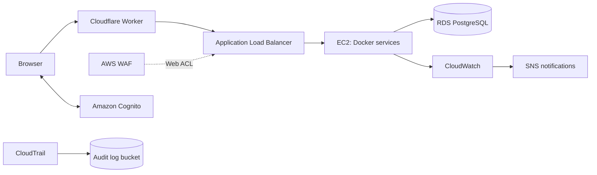

# AWS deployment architecture

The Cloudflare Worker routes browser and API traffic to the application hosted on EC2 through the WAF-associated ALB. Cognito supplies application authentication. CloudTrail, CloudWatch and SNS provide the recorded logging and monitoring configuration.

The environment uses one AWS account with logical application and security zones. EC2 is in a public subnet; RDS uses private database subnets and linked security groups. The observed ALB listener is HTTP on port 80, so edge TLS does not establish origin-hop encryption. Incident-response automation is architectural context unless separately demonstrated.

Read the [configuration baseline](../06_Configuration/01_AWS_Environment_Baseline.md) for the observed resource settings and the [evidence limitations](../14_Appendices/Evidence_Gaps_and_Interpretation.md) for assurance boundaries.

## Conceptual diagrams

- [Application and security zones](Architecture_Reference_Application_and_Security_Zones.png)
- [Detailed reference architecture](Architecture_Reference_Detailed.png)

These reference diagrams include proposed incident-response automation and logical zones. The configuration baseline and test results establish which controls were observed in the lab.
